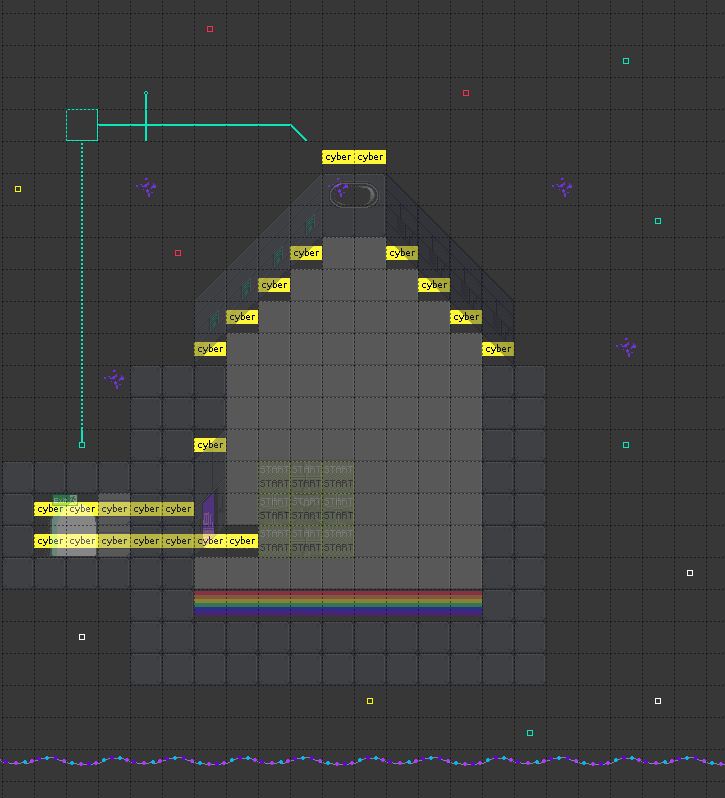

# Basic Room

Stefan made this room withouth knowing much about 2D tiles and no time.

Please improve it, by either messaging [@dns2utf8](https://twitter.com/dns2utf8) or sending a PR

## Playable level

https://play.workadventu.re/_/global/ccc-rustaceans.github.io/room-map/main.json

## Loadable with github pages

https://ccc-rustaceans.github.io/room-map/main.json

## Software used: Tiled

```
sudo pacman -S community/tiled # 1.4.3-2
```

## Tutorial

https://howto.rc3.world/maps.html

## A screenshot:


